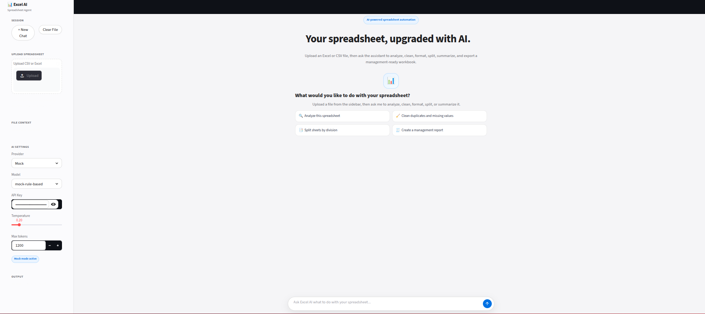
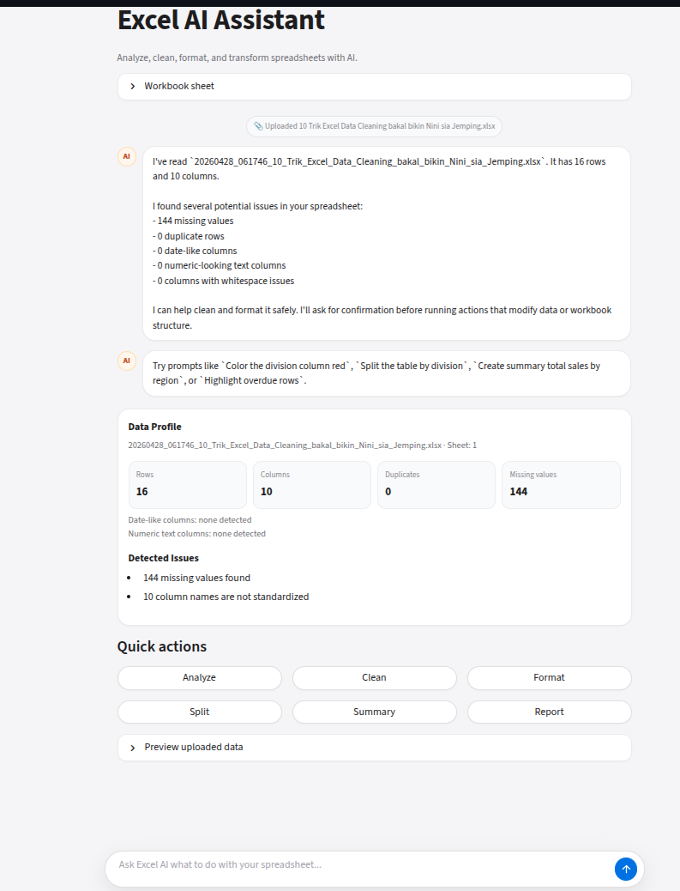
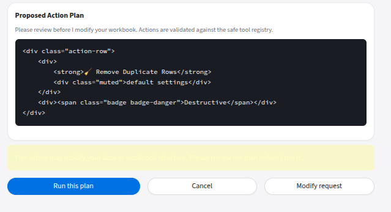
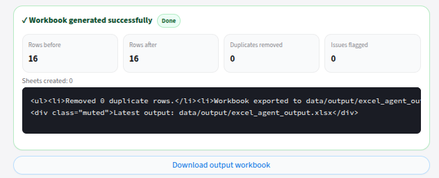

# AI Excel Assistant / Spreadsheet Automation Assistant

## Overview
AI Excel Assistant is a chatbot-first internal tool for modernizing spreadsheet operations.  
Users upload CSV/XLSX files, ask questions about data quality, receive safe action plans, confirm changes, and download a management-ready Excel workbook.

## Business Problem
Many operations teams still run critical workflows in manual spreadsheets. This creates recurring risks:

- Duplicate rows causing double counting
- Missing fields (owner/status/date) causing follow-up delays
- Numeric values stored as text breaking calculations
- Inconsistent formatting/casing reducing dashboard reliability
- Repetitive manual cleaning and reporting work

## Solution
This project combines Python automation, pandas transformations, openpyxl Excel export, Streamlit chat UI, and AI planning to convert static spreadsheets into intelligent, guided workflows.

Core flow:

`upload -> profile -> recommend -> confirm -> execute -> export -> report`

## Key Features
- Chat-based spreadsheet assistant (Streamlit `st.chat_message`, `st.chat_input`)
- CSV/XLSX upload with automatic profiling
- Data-quality detection (missing values, duplicates, invalid dates, numeric text issues)
- Safe action planning with confirmation before destructive operations
- Whitelisted tool execution (no arbitrary code execution from AI output)
- Excel formatting/highlighting/splitting/group summaries
- API enrichment with requests + deterministic fallback
- Management-ready workbook export with summary/report sheets
- Provider selection: Mock, OpenAI, OpenRouter

## Tech Stack
- **Backend automation**: Python
- **Data processing**: pandas
- **Excel automation**: openpyxl
- **API integration**: requests
- **Validation/schema**: pydantic
- **UI**: Streamlit
- **Testing**: pytest

## Architecture
```text
app/
  ai/
    providers/              # OpenAI/OpenRouter/Mock provider adapters
    model_registry.py
  excel_agent/
    profiler.py             # data profiling + issue detection
    planner.py              # NL prompt -> structured tool plan
    executor.py             # validated tool execution
    exporter.py             # openpyxl workbook export + styling
    tools/
      registry.py           # whitelisted tools + schemas
      implementations.py
  processing/               # additional cleaning/export pipeline modules
  ui/
    streamlit_app.py        # chatbot UI
    components.py
    styles.py
tests/                      # unit tests for planner/profiler/executor/exporter/tools
docs/                       # pitch and demo documentation
```

## Demo Flow
1. Run the Streamlit app.
2. Choose provider (Mock/OpenAI/OpenRouter) in sidebar.
3. Upload messy CSV/XLSX.
4. Assistant posts profile summary and recommendations.
5. Ask natural prompts (cleaning/formatting/splitting/reporting).
6. Review proposed action plan.
7. Confirm plan for destructive actions.
8. Download generated workbook with cleaned data and reports.

## How to Run
```bash
python3 -m venv .venv
source .venv/bin/activate
pip install -r requirements.txt
python -m pytest
python -m streamlit run app/ui/streamlit_app.py
```

## Example Prompts
- `Analyze this spreadsheet and tell me what can be improved.`
- `Remove duplicates and create flagged issues sheet.`
- `Color the Division column red.`
- `Split this workbook by Division.`
- `Create summary total sales by Region.`
- `Sort salary from highest.`
- `Create a management report.`
- `Highlight overdue rows.`

## Job Requirement Mapping
| Job Requirement | How This Project Addresses It |
|---|---|
| Analyze and optimize Excel-based systems | Profiles spreadsheet structure and quality issues (missing values, duplicates, invalid dates, numeric text, casing/whitespace inconsistencies). |
| Build automation using Python, Pandas, OpenPyXL, APIs | Uses pandas for transform/cleaning, openpyxl for workbook styling/export, and requests-based enrichment APIs with fallback behavior. |
| Integrate AI / LLM workflow tools | Chat assistant translates user prompts into validated structured tool calls (OpenAI/OpenRouter/Mock). |
| Design scalable data workflows | Modular architecture separates profiler, planner, tool registry, executor, exporter, provider layer, and UI. |
| Transform static spreadsheets into intelligent tools | Adds chat-driven analysis, recommendations, confirmations, managed execution, and management-ready workbook outputs. |
| Work with management to identify inefficiencies | Generates reports/insights highlighting business impact (double counting risk, accountability gaps, timeline/reporting risks). |

## Screenshots





## Limitations
- LLM responses depend on provider/model availability.
- Mock mode is deterministic and conservative by design.
- Very large workbooks may need sampling and staged execution.
- Tool execution is intentionally limited to safe whitelisted actions.

## Future Improvements
- Multi-file/session workspace management
- Richer charting and KPI dashboard sheet generation
- Role-based action templates (Ops/Finance/Sales)
- Background jobs for heavy workbook processing
- Telemetry/analytics for repeated inefficiency patterns
